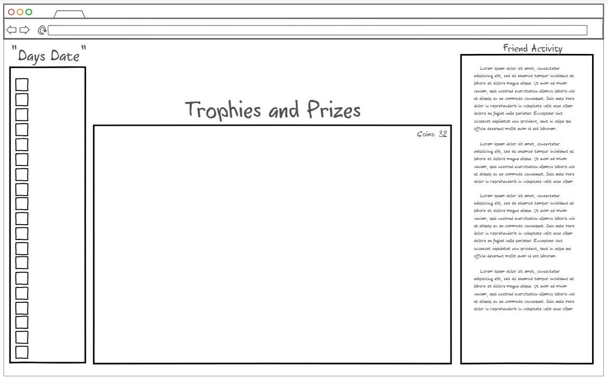
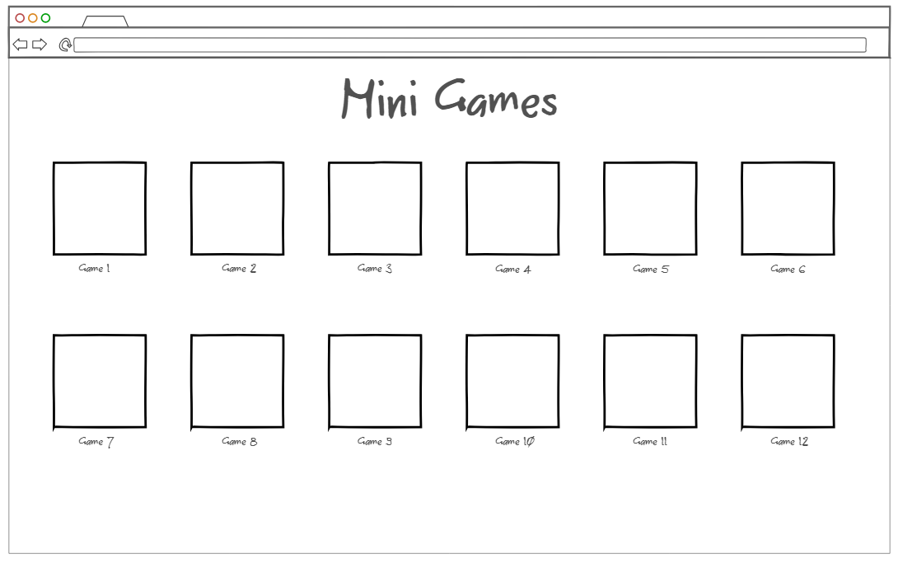
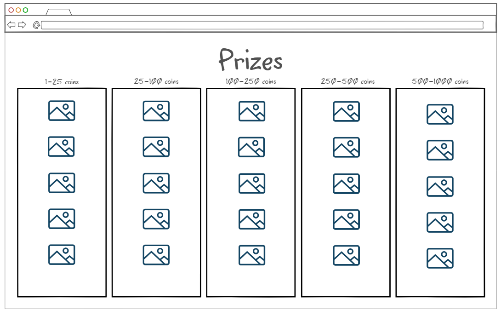

# Elevator Pitch

 Many people struggle to stay orginized and get certain tasks done. This piece of software is used to combat that by allowing an interactive to do list. Add your friends to see if they are keeping up with their daily goals, while also being held accountable to yours. By completing tasks, your friends are able to judge if you actually completed your goals. Once completed you are gifted coins that can be spent on mini games and other in game cosmetics that can be used to decorate your profile and show off to others.

# Design 

# Backend

# Key Features.
* Login page with HTTPS
* Make and Check off Todo list
* Share list with others
* Get rewarded for Completing Tasks
* Be able to get cosmitics and other in game decorations

# Technologies 

HTML: 3 Main HTML pages for the check list, mini games, and prizes. everything is hyperlinked using HTML

CSS: Used to make the front end presentable on all devices and format so users are able to effectivly use it. 

Javascript: Mainly will be used for the Mini game section of the Site. Will also be used for logining in and displaying others actions

Database: Store all of users trophies and goals, will not store indivual task since it would use to much space. It will simply run a tally on how many tasks completelted, not what each task was.  All login details will also be stored

Websocket: Used to broadcast when you complete a task to your friends that the task was completed 

React: Application will be ported to the React Framework

